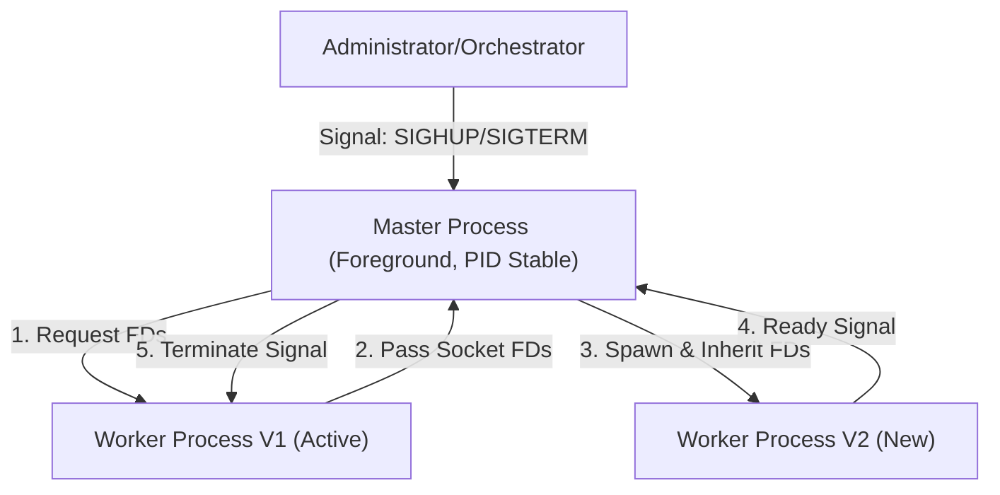
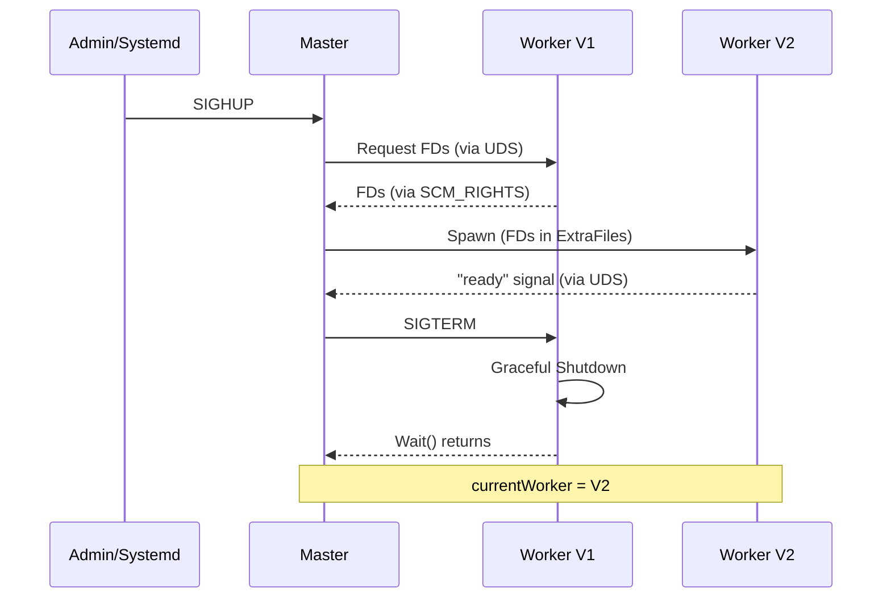

# Bifrost Hot Reload Architecture Specification

## 1. Background

### Core Objective
Bifrost adopts a **Master-Worker** architecture to provide stable PID and zero-downtime hot reload capabilities. This architecture is designed to be cloud-native first while remaining compatible with traditional Systemd environments.

### Domain Context
- **Master**: A lightweight parent process responsible for managing the Worker's lifecycle. Its PID remains constant throughout the service's lifetime.
- **Worker**: The child process that actually carries business traffic (Bifrost Server). It is started by the Master and replaced during a hot reload.
- **Hot Restart (Hot Reload)**: The process of replacing an old version of code or configuration with a new version without interrupting existing connections.
- **Socket Passing**: A technique to pass listening file descriptors (FDs) from an old process to a new process via Unix Domain Sockets.

---

## 2. Objectives

### Functional Objectives
1. **PID Constancy**: The Master PID remains unchanged across multiple hot restarts.
2. **Broad Compatibility**: Native support for Systemd (`Type=notify`), Docker, and Kubernetes.
3. **Seamless Handover**: Ensure no packet loss or connection drops during Worker transition.
4. **Unified Logging**: All logs are output via stdout/stderr, compatible with various log collection systems.
5. **Log Rotation**: Supports triggering log file reopening via the `SIGUSR1` signal.

### Non-functional Objectives
1. **Low Intrusiveness**: The Master is lightweight and does not participate in actual business traffic processing.
2. **Observability**: The Master clearly reports the current status of the Worker.

---

## 3. Technical Solution

### Architecture Design

Adopts a **Foreground Master-Worker** model:



### Execution Modes

Bifrost runs in foreground mode, with process management handled by external tools:

| Environment | Process Management | Log Collection |
| :--- | :--- | :--- |
| Local Dev | Shell (Stop via Ctrl+C) | Terminal stdout |
| Systemd | `systemctl start/stop/reload` | Journald |
| Docker | Docker daemon | `docker logs` |
| Kubernetes | Kubelet | Sidecar / stdout |

### CLI Design

| Flag              | Description                                      |
| :---------------- | :----------------------------------------------- |
| `-t`, `--test`    | Test if the configuration file format is correct |
| `-c`, `--conf`    | Specify the configuration file path              |
| `-v`, `--version` | Show version information                         |

### Signal Handling

| Signal | Behavior |
| :--- | :--- |
| `SIGHUP` | Trigger Hot Reload |
| `SIGTERM` / `SIGINT` | Graceful Shutdown |
| `SIGUSR1` | Reopen log files (Log Rotation) |

---

### Systemd Integration (Type=notify)

```ini
# /etc/systemd/system/bifrost.service
[Unit]
Description=Bifrost Gateway
After=network.target

[Service]
Type=notify

ExecStart=/usr/local/bin/bifrost -c /etc/bifrost/config.yaml
ExecReload=/bin/kill -HUP $MAINPID

TimeoutStopSec=30s
Restart=on-failure

[Install]
WantedBy=multi-user.target
```

**Key Behavior**: The Master calls `sd_notify("READY=1")` after the Worker confirms it is "Ready" to inform Systemd that the service is up.

---

### Internal Control Plane

- **Unix Domain Socket (UDS)**: Master acts as a Server, Worker acts as a Client.
- **Socket Path**: Uses **Linux Abstract Namespace** (e.g., `\x00bifrost-{pid}.sock`).
  - *Rationale*: Abstract sockets do not create physical files in the filesystem, avoiding accidental deletion or permission issues.
- **Purpose**:
  - **Registration**: Worker reports to Master after startup and initialization.
  - **FD Passing**: During hot reload, the old Worker sends FDs to the Master via this channel.
  - **Ready Signal**: Master confirms service readiness upon receiving the "Register" message from the Worker.

---

### Socket Passing Mechanism

Adopts the **Master Intermediary** model:
1. Worker V1 sends FDs to Master (via UDS).
2. Master spawns Worker V2, passing the FDs to V2 via `ExtraFiles`.

*Advantage*: Worker V1 and V2 do not need to be aware of each other, decoupling process dependencies.

---

### Hot Reload Full Flow



---

### Master-Worker Monitoring (KeepAlive)

- **Active Monitoring**: Master uses `cmd.Wait()` to blocking-wait for Worker exit.
- **Restart Decision**: If a Worker exits unexpectedly, the Master automatically restarts a new Worker.
- **Backoff Strategy**: Exponential backoff (1s → 2s → 4s → ... → 32s).
- **Rate Limiting**: Maximum 5 retries within a single minute; if exceeded, the Master exits with an error.

---

## 4. Log Aggregation

All logs from Master and Worker are output to stdout/stderr:

- Master inherits stdout/stderr from the terminal/Systemd/container at startup.
- Master spawns Worker, setting its own stdout/stderr as the Worker's standard output.
- **Result**: Zero performance overhead as no application-layer forwarding is required; perfectly supports Docker/Kubernetes log collection.

---

## 5. Log Rotation

Bifrost supports triggering log file reopening via the `SIGUSR1` signal, which is useful when working with tools like `logrotate`.

### Signal Propagation
1. External tools (e.g., `logrotate`) send `SIGUSR1` to the **Master** process.
2. **Master** receives the signal:
   - Reopens its own log files (if file output is configured).
   - Forwards `SIGUSR1` to the currently active **Worker** process.
3. **Worker** receives the signal and reopens its log files.

### Logrotate Configuration Example
Since the Master process name is fixed as `bifrost-master`, we can use `pkill` to send the signal without relying on a PID file:

```bash
/home/bifrost/logs/*.log {
    daily
    rotate 7
    compress
    missingok
    notifempty
    create 0640 nobody nogroup
    sharedscripts
    postrotate
        # Match process name "bifrost-master" exactly
        pkill -USR1 -x bifrost-master || true
    endscript
}
```

---

## 6. Validation & Testing

### Systemd Integration Test (`Type=notify`)
- Configure `ExecStart=/usr/local/bin/bifrost -c config.yaml`.
- Verify `systemctl start` only returns after the Worker is Ready.
- Verify `systemctl reload` triggers a Worker hot reload while the Master PID remains constant.
- Verify `journalctl -u bifrost` shows logs from both Master and Worker.

### E2E Testing
```bash
./bifrost -c config.yaml &
MASTER_PID=$!
sleep 2
# Test hot reload
kill -HUP $MASTER_PID
# Verify Worker restart...
# Test stop
kill -TERM $MASTER_PID
wait $MASTER_PID
```

### Zero-Downtime Test
- Use `k6` for continuous load testing; error rate should be zero during hot reload.

---

## 7. Caveats

1. **Signal Forwarding Latency**: There is a minor delay when the Master forwards signals to the Worker.
2. **Signals during Hot Reload**: When a hot reload is in progress and multiple Workers exist, `SIGUSR1` is only sent to the "currently active" Worker (newWorker). The old Worker, which is gracefully shutting down, will continue writing to the original log file until it terminates.
3. **Zombie Processes**: Master must correctly call `Wait()`, otherwise exited Workers will become zombie processes.
4. **Windows Compatibility**: This architecture relies on Unix signals and is not supported on Windows.

---

## 8. Technical Review Conclusion

**Review Result**: ✅ **Approved**

*Review Date: 2026-01-06*
