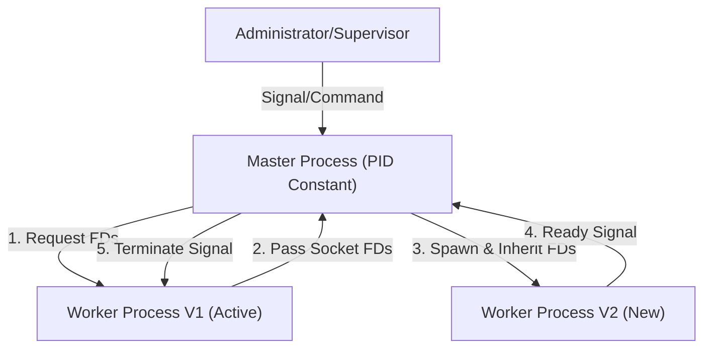

# Bifrost Hot Reload Architecture Specification

## 1. 背景 (Background)

### 核心痛點
Bifrost 目前採用的熱重啟機制是基於 **Self-Exec (自我重啟)** 模式。在此模式下，舊進程 Fork 新進程並轉交 Socket 後退出，導致服務進程的 PID 在每次重啟後都會改變。
這種 PID 易變性與主流的進程管理工具（如 Supervisor、Systemd 非 Notify 模式、K8s Liveness Probes）存在本質衝突。這些工具通常依賴恆定的 PID 或父進程關係來判斷服務健康狀態。為了在生產環境中提供更廣泛的兼容性和穩定性，我們需要引入一種 PID 恆定的架構。

### 領域名詞定義 (Domain Context)
- **Master (Wrapper)**: 一個輕量級的父進程，負責管理 Worker 的生命週期、信號轉發和配置監聽。它的 PID 在服務生命週期內保持不變。
- **Worker**: 實際承載業務流量的子進程（Bifrost Server）。它由 Master 啟動，並在熱更新時被替換。
- **Hot Restart (熱重啟/熱更新)**: 在不中斷現有連接的情況下，用新版本的代碼或配置替換舊版本的過程。
- **Socket Passing**: 通過 Unix Domain Socket 或其他機制，將監聽中的文件描述符 (FD) 從舊進程傳遞給新進程的技術。

---

## 2. 目標 (Objectives)

### 功能目標
1. **PID 恆定性**: 對外暴露的服務 PID（Master PID）在多次熱重啟期間必須保持不變。
2. **廣泛兼容性**: 原生支持 Supervisor、Systemd (Simple Type)、Docker 等依賴 PID 監控的工具。
3. **無縫切換**: 繼承現有的 Zero-Downtime 能力，確保 Worker 切換期間不丟失連接。
4. **向後兼容性**: 保留對傳統 CLI 命令 (`bifrost -d`, `-u`, `-s`) 的支持，確保非 Systemd/Supervisor 環境下的手動維運能力。

### 非功能目標
1. **低侵入性**: Master 應儘可能輕量，不參與實際的業務流量處理。
2. **可觀測性**: Master 應能清楚報告當前 Worker 的狀態和 PID 變化。

---

## 3. 現況分析 (Current State & Gap Analysis)

### 現狀 (Current Architecture)
- **模式**: Self-Exec (PID A -> spawn PID B -> PID A exits).
- **優點**: 實現簡單，單一二進制文件。
- **缺點**: PID 變化導致 Supervisor 認為進程崩潰而觸發錯誤重啟，產生 "腦裂" (多個進程同時搶占端口)。

### 差距 (Gap)
- **缺少穩定的監控錨點**: 進程管理器無法鎖定一個穩定的 PID 進行監控。
- **信號處理耦合**: 業務邏輯與進程管理邏輯高度耦合在同一個二進制中。

---

## 4. 技術方案 (Technical Solution)

### 架構設計 (Architecture Design)

採用 **Master-Worker** 模型（類似 Envoy 的 Restarter Wrapper 或 Nginx 架構）：



### 核心實作 (Core Implementation)

1.  **用戶接口與 Systemd 集成 (User Interface & Systemd)**:
    
    為了提供最佳的用戶體驗，我們將保留現有的 CLI 習慣，並無縫集成 Systemd。

    **CLI 命令映射 (Command Mapping)**:
    - `./bifrost`: **(前台 Master 模式)** 啟動 Master 進程並阻塞在前台。
        - **適用場景**: Systemd (`Type=simple`), Docker, Kubernetes。
        - **理由**: 讓 Systemd/Docker 直接接管日誌 (stdout/stderr) 與生命週期。
        - **生命週期**: Master 與 Worker 共生死。Master 收到退出信號時，會先轉發 SIGTERM 給 Worker 並等待其優雅退出後才結束，確保請求不中斷。
    - `./bifrost -d`: **(後台 Master 模式)** 啟動 Master 並將其 Fork 為 Daemon（後台運行）。
        - **適用場景**: Systemd (`Type=forking`), 傳統 Shell 手動運行。
        - **理由**: 支持標準的 Daemon 行為（Fork + PID File），相容 Nginx 等傳統服務的運維模式。
    - `./bifrost -u`: 在後台查找 Master PID 並發送 `SIGHUP` 觸發熱更新。
    - `./bifrost -s`: 在後台查找 Master PID 並發送 `SIGTERM` 觸發優雅關閉。
    **Systemd Unit File 設計 (支持 Forking 模式)**:
    
    鑑於 Nginx 等傳統服務的慣例，我們將支持標準的 `Type=forking` 模式。這要求 Master 在後台化後正確寫入 PID 文件。

    ```ini
    # /etc/systemd/system/bifrost.service
    [Unit]
    Description=Bifrost Gateway
    After=network.target

    [Service]
    # 使用 forking 類型，符合 Nginx/Pingora 等傳統服務習慣
    Type=forking
    
    # 啟動 Master並後台化 (-d)，Master 需寫入 PID 文件
    ExecStart=/usr/local/bin/bifrost -d -c /etc/bifrost/config.yaml
    
    # 指定 PID 文件路徑，Systemd 據此追蹤 Master 進程
    PIDFile=/var/run/bifrost.pid
    
    # 熱重啟: 發送 HUP 給 Master (PIDFile 中的 PID)
    ExecReload=/bin/kill -HUP $MAINPID
    
    # 優雅關閉
    ExecStop=/bin/kill -TERM $MAINPID
    
    TimeoutStopSec=30s
    Restart=always

    [Install]
    WantedBy=multi-user.target
    ```

    **關鍵實作細節**: 
    為了避免 Systemd 在 PID 文件寫入前就讀取導致失敗 (Race Condition)，Master 後台化必須實現**嚴格順序保證**：
    1. Parent 啟動並創建 Pipe。
    2. Parent Fork 出 Child (Daemon Master)。
    3. Child 初始化並原子寫入 PID 文件。
    4. Child 通過 Pipe 通知 Parent "Ready"。
    5. Parent 收到通知後才退出 (Exit 0)。
    這確保了當 Systemd 檢測到 `ExecStart` 退出時，磁盤上絕對已經存在正確的 PID 文件，**無需使用 `sleep` 等待**。

2.  **內部通信機制 (Internal Control Plane)**:
    - **Unix Domain Socket (UDS)**: Master 作為 Server 監聽，Worker 作為 Client 連接。
    - **文件路徑**: 優先使用 **Linux Abstract Namespace** (如 `@bifrost.sock`)。
        - *理由*: Abstract Socket 不在文件系統中產生實體文件，**完全避免了文件被誤刪**或權限錯誤的風險，具備極高的可靠性。
        - *Fallback*: 若環境不支持，使用常規文件並配合 flock 與 Notify 機制監控重建。
    - **生命週期**: Master 啟動時創建監聽，直至 Master 退出。
    - **用途**:
        - **註冊 (Register)**: Worker 啟動後向 Master 報到。
        - **FD 傳遞**: 熱更新時，舊 Worker 通過此通道將 FD 發送給 Master。
        - **就緒信號**: 新 Worker 初始化完成後通過此通道通知 Master。
    
3.  **Socket 傳遞機制 (Socket Passing)**:
    - **機制選擇**: 採用 **Master 中轉** 模式。
        - Worker V1 將 FD 發送給 Master (via UDS)。
        - Master 啟動 Worker V2 時，將 FD 作為 `ExtraFiles` 傳遞給 V2。
    - *優點*: Worker V1 和 V2 無需互相感知，解耦了進程依賴。Master 擁有所有資源的控制權。

4.  **Master-Worker 監控機制 (Process Monitoring)**:
    Master 作為 Worker 的父進程，通過以下機制監控 Worker 的健康狀態：
    
    - **主動監控 (Active Monitoring via `cmd.Wait()`)**:
        - Master 使用 `exec.Cmd.Start()` 啟動 Worker 後，在後台 Goroutine 中調用 `cmd.Wait()` 阻塞等待 Worker 退出。
        - 當 `Wait()` 返回時，Master 立即知悉 Worker 已結束，並可檢查 `ProcessState` 獲取退出碼和信號信息。
        - **優點**: 無需處理 `SIGCHLD` 信號，Go 運行時已封裝。
    
    - **重啟決策 (KeepAlive Strategy)**:
        - 若 Worker 是 **非預期退出** (非 SIGTERM/SIGINT 觸發)，Master 應自動重啟新 Worker。
        - **退避策略**: 指數退避 (Exponential Backoff)，初次重試 1s，隨後 2s, 4s...，最大 32s。
        - **最大重試次數**: 同一分鐘內最多重試 5 次，超過則認為 Worker 存在致命問題，Master 也顯著退出並報錯。
    
    - **狀態判斷 (Exit Reason Detection)**:
        - 通過 `ProcessState.ExitCode()` 和 `ProcessState.Sys().(syscall.WaitStatus)` 判斷退出原因。
        - 若因信號退出，可通過 `WaitStatus.Signal()` 獲取具體信號 (SIGKILL, SIGSEGV 等) 並記錄日誌。

5.  **數據結構設計**:
    ```go
    type Master struct {
        currentWorker *os.Process
        nextWorker    *os.Process
        state         MasterState
        mutex         sync.Mutex
    }
    ```

6.  **開發實作細節補充 (Implementation Notes for Golang Developers)**:

    以下是開發過程中需要注意的具體實作細節：

    #### 6.1 Master 如何識別運行模式
    - **環境變數區分**: Master spawn Worker 時設置 `BIFROST_ROLE=worker` 環境變數。
    - **啟動邏輯**:
      ```go
      func main() {
          if os.Getenv("BIFROST_ROLE") == "worker" {
              runAsWorker()  // 實際處理流量
          } else {
              runAsMaster()  // 管理 Worker 生命週期
          }
      }
      ```
    - **Worker 啟動命令**: Master 使用相同的二進制檔案，僅透過環境變數區分角色。

    #### 6.2 UDS 通信協議設計
    - **Socket 路徑**: 使用 Abstract Namespace `\x00bifrost-{pid}.sock`（以 null byte 開頭）。
    - **協議格式**: 建議使用簡單的 JSON 或 Length-Prefixed Binary。
    - **消息類型**:
      ```go
      type ControlMessage struct {
          Type    string `json:"type"`    // "register", "ready", "fd_transfer", "shutdown"
          Payload []byte `json:"payload"` // 可選的附加數據
      }
      ```
    - **FD 傳遞方式**: 使用 `unix.Sendmsg()` / `unix.Recvmsg()` 搭配 `unix.UnixRights()` 傳遞文件描述符。

    #### 6.3 Daemon 化的 Pipe 同步實作
    ```go
    func daemonize() error {
        r, w, _ := os.Pipe()
        
        cmd := exec.Command(os.Args[0], os.Args[1:]...)
        cmd.Env = append(os.Environ(), "BIFROST_DAEMONIZED=1")
        cmd.ExtraFiles = []*os.File{w}  // FD 3 = write end of pipe
        
        if err := cmd.Start(); err != nil {
            return err
        }
        w.Close()
        
        // 等待 Child 發送 "ready" 信號
        buf := make([]byte, 5)
        n, _ := r.Read(buf)
        if string(buf[:n]) == "ready" {
            os.Exit(0)  // Parent 正常退出
        }
        return errors.New("daemon failed to start")
    }
    ```

    #### 6.4 熱更新完整流程 (時序圖)
    ```
    Master                     Worker V1                  Worker V2
      |                           |                          |
      |--- SIGHUP received ------>|                          |
      |                           |                          |
      |--- Request FDs via UDS -->|                          |
      |<-- FDs sent via UDS ------|                          |
      |                           |                          |
      |--- Spawn Worker V2 (with FDs in ExtraFiles) -------->|
      |                           |                          |
      |<----------------- "ready" signal via UDS ------------|
      |                           |                          |
      |--- SIGTERM --------------->|                          |
      |                           |-- graceful shutdown ---->|
      |<-- Wait() returns --------|                          |
      |                           X                          |
      |                                                      |
      |<-- currentWorker = V2 --------------------------------|
    ```

    #### 6.5 優雅關閉 (Graceful Shutdown) 詳細流程
    - **Master 收到 SIGTERM 時**:
      1. 停止接受新的熱更新請求 (設置 `shuttingDown = true`)
      2. 向 currentWorker 發送 SIGTERM
      3. 調用 `cmd.Wait()` 等待 Worker 退出（最多等待 `TimeoutStopSec` 秒）
      4. 若超時未退出，發送 SIGKILL
      5. 清理 PID 文件後退出

    #### 6.6 錯誤處理策略
    - **Worker 啟動失敗**: 記錄錯誤日誌，觸發 KeepAlive 重啟策略。
    - **UDS 連接失敗**: Worker 應在連接失敗時以非零退出碼退出，讓 Master 感知異常。
    - **FD 傳遞失敗**: 熱更新中止，舊 Worker 繼續運行，記錯誤日誌並發送告警。

    #### 6.7 配置文件路徑傳遞
    - Master 在 spawn Worker 時，透過命令行參數傳遞配置文件路徑：
      ```go
      cmd := exec.Command(os.Args[0], "-c", configPath)
      cmd.Env = append(os.Environ(), "BIFROST_ROLE=worker")
      ```

---

## 5. 驗證與測試策略 (Validation)

### 5.1 功能驗證

1.  **Systemd 集成測試**:
    - **Type=simple (前台模式)**:
        - 配置 `ExecStart=/usr/local/bin/bifrost`。
        - 驗證 `systemctl start/reload/stop` 正常工作，且日誌正確輸出到 journald。
    - **Type=forking (後台模式)**:
        - 配置 `ExecStart=/usr/local/bin/bifrost -d` 及 `PIDFile`。
        - 驗證 `systemctl start` 啟動成功（無超時，驗證 PID 文件順序保證）。
        - 驗證 `systemctl reload` 觸發 Worker 熱更新但 Master PID 不變。

2.  **CLI 手動運維測試 (非 Systemd 環境)**:
    - **Daemon 啟動**: 執行 `bifrost -d`，驗證進程後台化且 PID 文件生成。
    - **熱更新**: 執行 `bifrost -u`，驗證舊 Worker 退出，新 Worker 啟動，Master PID 不變。
    - **優雅關閉**: 執行 `bifrost -s`，驗證 Master 與 Worker 均正確退出，PID 文件被清理。

3.  **日誌聚合行為 (Log Aggregation)**:
    - **前台模式 (`./bifrost`)**: 
        - Master 啟動時繼承終端的 `stdout/stderr`。
        - Master Spawn Worker 時，將自身的 `stdout/stderr` 作為 Worker 的標準輸出。
        - **效果**: Worker 的日誌直接流向 Master 的輸出流（操作系統級別 FD 繼承），無需 Master 進行應用層轉發，性能損耗為零，完美支持 Docker/Kubernetes 日誌採集。
    - **後台模式 (`./bifrost -d`)**:
        - Master 將 stdout/stderr 重定向到指定的日誌文件。
        - Worker 繼承這些文件描述符，日誌自動寫入相同文件。

### 5.2 數據一致性校驗 (Balance Check)
- **連接不中斷**: 使用 `wrk` 或 `ab` 進行持續壓測，在熱更新期間，錯誤率 (Non-2xx) 應為 0。
- **FD 洩漏檢查**: 檢查 `/proc/<PID>/fd`，確保舊 Worker 退出後，相關 FD 被正確釋放/轉移。

---

## 6. 注意事項 (Caveats & Trade-offs)

### 風險與限制
1.  **信號轉發延遲**: Master 接收信號並轉發給 Worker 存在微小的延遲，需確保這種異步性不會影響 `SIGTERM` 的優雅退出時限。
2.  **複雜性增加**: 維護兩個進程上下文（Master 和 Worker）比單一進程複雜，特別是在日誌聚合和錯誤處理方面。
3.  **殭屍進程 (Zombie Process)**: Master 必須正確處理 `SIGCHLD` 信號或調用 `Wait()`，否則退出的舊 Worker 會變成殭屍進程。
4.  **Windows 兼容性**: 由於依賴信號和 Fork 機制，此架構在 Windows 上的支持受限（這與現狀一致，但需明確聲明）。

### 結論
採用 Master-Worker 架構是解決進程管理工具兼容性的標準且成熟的方案。儘管增加了工程複雜度，但換來了生產環境部署的標準化和穩定性，長遠來看收益大於成本。

---

## 7. 技術評審 (Technical Review)

**評審日期**: 2026-01-05 (第三版)  
**評審角色**: 網關架構師 (Gateway Architect)  
**評審範圍**: Master-Worker 熱更新架構設計

---

### 7.1 與業界標準的對比分析

#### Nginx 對比
| 面向 | Nginx | Bifrost (本規格) | 評價 |
|------|-------|------------------|------|
| 進程模型 | Master-Worker (多 Worker) | Master-Worker (單 Worker) | ✅ 簡化設計，符合 Go 語言特性 |
| Socket 傳遞 | `SO_REUSEPORT` / 繼承 FD | Master 中轉 via UDS + `ExtraFiles` | ✅ 規格明確，設計完整 |
| 信號處理 | `SIGHUP` = Reload, `SIGTERM` = Quit | 同上 | ✅ 完全符合 Unix 慣例 |
| PID 恆定 | Master PID 恆定 | Master PID 恆定 | ✅ 核心目標達成 |
| Daemon 化 | Fork + PID File | Fork + Pipe 同步 + PID File | ✅ 解決 Race Condition |
| KeepAlive | 自動重啟 Worker | 指數退避 + 頻率限制 | ✅ 設計合理 |

#### Envoy 對比
| 面向 | Envoy | Bifrost (本規格) | 評價 |
|------|-------|------------------|------|
| 熱重啟機制 | hot-restarter.py wrapper | Go 原生 Master | ✅ 減少外部依賴 |
| Draining | Epoch-based connection draining | Graceful shutdown | ✅ 更簡單但需考慮長連接場景 |
| 內部通信 | UDS + RPC | UDS (Abstract Namespace) | ✅ 設計合理，可靠性高 |
| 進程監控 | `cmd.Wait()` | `cmd.Wait()` + ProcessState | ✅ 無需 SIGCHLD 處理 |

#### Systemd 整合
本規格正確支持 Systemd 的兩種模式：
- **Type=simple**: 前台模式 (`./bifrost`)，Systemd 直接管理 Master ✅
- **Type=forking**: 後台模式 (`./bifrost -d`)，使用 Pipe 同步保證 PID 文件正確性 ✅

---

### 7.2 架構正確性分析

#### ✅ 所有關鍵設計已確認

1. **PID 恆定性設計正確**: Master 作為穩定的監控錨點，與 Supervisor/Systemd 完全兼容。

2. **CLI 設計明確**: 
   - `./bifrost` = 前台 Master (適用 Docker/K8s/Systemd simple)
   - `./bifrost -d` = 後台 Master (適用傳統 Daemon/Systemd forking)
   - `./bifrost -u/-s` = 控制命令

3. **Socket 傳遞機制完整**: 採用 **Master 中轉** 模式，解耦 Worker V1 與 V2 的依賴關係。

4. **內部通信機制設計優秀**: 
   - 使用 Linux Abstract Namespace UDS，避免文件系統問題
   - 支持 FD 傳遞、就緒信號、進程註冊

5. **日誌聚合設計零損耗**: FD 繼承機制無需應用層轉發，完美支持容器化環境。

6. **Daemon 化 Race Condition 已解決**: Pipe 同步機制確保 PID 文件寫入順序。

7. **驗證策略完整**: 涵蓋 Systemd 兩種模式、CLI 手動運維、日誌行為測試。

8. **KeepAlive 重啟策略完整** *(新增)*:
   - ✅ 使用 `cmd.Wait()` 主動監控 Worker 退出
   - ✅ 指數退避策略: 1s → 2s → 4s → ... → 32s
   - ✅ 頻率限制: 同一分鐘內最多 5 次重試
   - ✅ 通過 `ProcessState` 判斷退出原因

---


### 7.3 與現有代碼的差距分析 (Gap Analysis)

| 功能 | 規格要求 | 現有實作 | 差距 |
|------|----------|----------|------|
| PID 恆定 | Master PID 恆定 | ⚠️ 目前 Worker 自己管理 PID file | 需重構 |
| 信號監聽 | Master 監聽 SIGHUP/SIGTERM | ✅ `WaitForUpgrade()` 已監聽 SIGHUP | 無 |
| Worker Spawn | Master spawn Worker | ⚠️ 目前是 self-exec | 需重構 |
| FD 傳遞 | Master 中轉 via UDS | ⚠️ 目前是 Worker 直接傳遞 | 需調整 |
| UDS 通信 | Abstract Namespace | ❌ 尚未實作 | 需新增 |
| PID 鎖 | 確保唯一性 | ✅ `WritePIDWithLock()` + flock | 無 |
| KeepAlive | 指數退避 + 頻率限制 | ❌ 尚未實作 | 需新增 |
| Pipe 同步 Daemon | Fork + Pipe + PID File | ❌ 現有使用環境變數 | 需新增 |

---

### 7.4 評審結論

**評審結果**: ✅ **通過 (Approved)**

本技術規格書在第三版中已完善所有關鍵設計：
- ✅ Mermaid 流程圖重複宣告問題已修復
- ✅ 章節編號已大幅改善 (已全數修正)
- ✅ KeepAlive 重啟策略已補充完整參數

**開發階段可正式開始**。


---

*評審者: Gateway Architecture Review*  
*評審日期: 2026-01-05 (第三版)*
