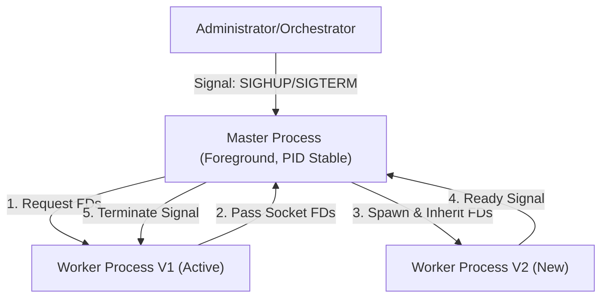
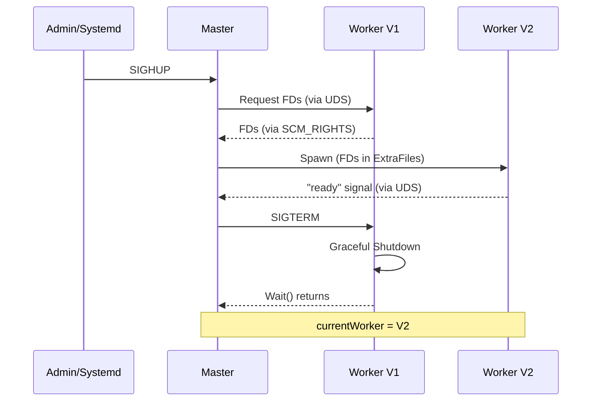

# Bifrost Hot Reload Architecture Specification

## 1. 背景 (Background)

### 核心目標
Bifrost 採用 **Master-Worker** 架構，提供穩定的 PID 和零停機熱更新能力。此架構設計為雲原生優先，同時兼容傳統 Systemd 環境。

### 領域名詞定義 (Domain Context)
- **Master**: 一個輕量級的父進程，負責管理 Worker 的生命週期。它的 PID 在服務生命週期內保持不變。
- **Worker**: 實際承載業務流量的子進程（Bifrost Server）。它由 Master 啟動，並在熱更新時被替換。
- **Hot Restart (熱重啟/熱更新)**: 在不中斷現有連接的情況下，用新版本的代碼或配置替換舊版本的過程。
- **Socket Passing**: 通過 Unix Domain Socket 將監聯中的文件描述符 (FD) 從舊進程傳遞給新進程的技術。

---

## 2. 目標 (Objectives)

### 功能目標
1. **PID 恆定性**: Master PID 在多次熱重啟期間保持不變。
2. **廣泛兼容性**: 原生支持 Systemd (`Type=notify`)、Docker、Kubernetes。
3. **無縫切換**: 確保 Worker 切換期間不丟失連接。
4. **日誌統一**: 所有日誌經由 stdout/stderr 輸出，兼容各種日誌採集系統。

### 非功能目標
1. **低侵入性**: Master 輕量，不參與實際的業務流量處理。
2. **可觀測性**: Master 清楚報告當前 Worker 的狀態。

---

## 3. 技術方案 (Technical Solution)

### 架構設計 (Architecture Design)

採用 **前台 Master-Worker** 模型：



### 運行模式

Bifrost 運行於前台模式，所有進程管理由外部工具負責：

| 環境 | 進程管理 | 日誌採集 |
| :--- | :--- | :--- |
| 本地開發 | Shell (Ctrl+C 停止) | Terminal stdout |
| Systemd | `systemctl start/stop/reload` | Journald |
| Docker | Docker daemon | `docker logs` |
| Kubernetes | Kubelet | Sidecar / stdout |

### CLI 設計

| Flag              | Description                                      |
| :---------------- | :----------------------------------------------- |
| `-t`, `--test`    | Test if the configuration file format is correct |
| `-c`, `--conf`    | Specify the configuration file path              |
| `-v`, `--version` | Show version information                         |

### 信號處理

| Signal | 行為 |
| :--- | :--- |
| `SIGHUP` | 觸發熱更新 (Hot Reload) |
| `SIGTERM` / `SIGINT` | 優雅關閉 (Graceful Shutdown) |

---

### Systemd 整合 (Type=notify)

```ini
# /etc/systemd/system/bifrost.service
[Unit]
Description=Bifrost Gateway
After=network.target

[Service]
Type=notify

ExecStart=/usr/local/bin/bifrost -c /etc/bifrost/config.yaml
ExecReload=/bin/kill -HUP $MAINPID

TimeoutStopSec=30s
Restart=on-failure

[Install]
WantedBy=multi-user.target
```

**關鍵行為**: Master 在 Worker 確認 Ready 後，調用 `sd_notify("READY=1")` 通知 Systemd 服務已就緒。

---

### 內部通信機制 (Internal Control Plane)

- **Unix Domain Socket (UDS)**: Master 作為 Server 監聽，Worker 作為 Client 連接。
- **Socket 路徑**: 使用 **Linux Abstract Namespace** (如 `\x00bifrost-{pid}.sock`)。
  - *理由*: Abstract Socket 不在文件系統中產生實體文件，避免誤刪或權限問題。
- **用途**:
  - **註冊 (Register)**: Worker 啟動並完成初始化後向 Master 報到。
  - **FD 傳遞**: 熱更新時，舊 Worker 通過此通道將 FD 發送給 Master。
  - **就緒信號**: Master 收到 Worker 的 Register 消息後，確認服務 Ready。

---

### Socket 傳遞機制 (Socket Passing)

採用 **Master 中轉** 模式：
1. Worker V1 將 FD 發送給 Master (via UDS)。
2. Master 啟動 Worker V2 時，將 FD 作為 `ExtraFiles` 傳遞給 V2。

*優點*: Worker V1 和 V2 無需互相感知，解耦了進程依賴。

---

### 熱更新完整流程



---

### Master-Worker 監控機制 (KeepAlive)

- **主動監控**: Master 使用 `cmd.Wait()` 阻塞等待 Worker 退出。
- **重啟決策**: 若 Worker 非預期退出，Master 自動重啟新 Worker。
- **退避策略**: 指數退避 (1s → 2s → 4s → ... → 32s)。
- **頻率限制**: 同一分鐘內最多重試 5 次，超過則 Master 退出並報錯。

---

## 4. 日誌聚合行為 (Log Aggregation)

Master 和 Worker 的日誌全部輸出到 stdout/stderr：

- Master 啟動時繼承終端/Systemd/容器的 stdout/stderr。
- Master Spawn Worker 時，將自身的 stdout/stderr 作為 Worker 的標準輸出。
- **效果**: 無需應用層轉發，性能損耗為零，完美支持 Docker/Kubernetes 日誌採集。

---

## 5. 驗證與測試策略 (Validation)

### Systemd 集成測試 (`Type=notify`)
- 配置 `ExecStart=/usr/local/bin/bifrost -c config.yaml`。
- 驗證 `systemctl start` 在 Worker Ready 後才返回。
- 驗證 `systemctl reload` 觸發 Worker 熱更新但 Master PID 不變。
- 驗證 `journalctl -u bifrost` 能看到 Master 和 Worker 的日誌。

### E2E 測試
```bash
./bifrost -c config.yaml &
MASTER_PID=$!
sleep 2
# 測試熱更新
kill -HUP $MASTER_PID
# 驗證 Worker 重啟...
# 測試停止
kill -TERM $MASTER_PID
wait $MASTER_PID
```

### 連接不中斷測試
- 使用 `k6` 持續壓測，熱更新期間錯誤率應為 0。

---

## 6. 注意事項 (Caveats)

1. **信號轉發延遲**: Master 轉發信號給 Worker 存在微小延遲。
2. **殭屍進程**: Master 必須正確調用 `Wait()`，否則退出的 Worker 會變成殭屍進程。
3. **Windows 兼容性**: 此架構依賴 Unix 信號，Windows 不支持。

---

## 7. 技術評審結論

**評審結果**: ✅ **通過 (Approved)**

*評審日期: 2026-01-06*
