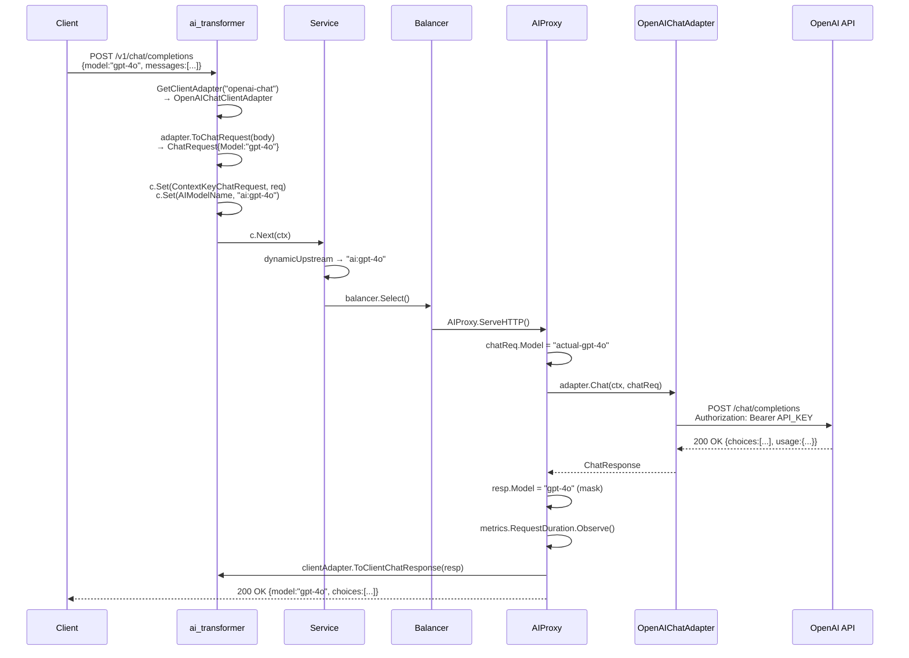

# AI Gateway Code Review — Opus Review

**Reviewer**: Claude Opus 4.6 (Thinking)  
**Date**: 2026-06-07 (Rev 3)  
**Spec**: [2026-05-30-ai-gateway-design.md](file:///home/jason/_repository/public/bifrost/docs/superpowers/specs/2026-05-30-ai-gateway-design.md)  
**Plan**: [2026-06-06-ai-gateway-full.md](file:///home/jason/_repository/public/bifrost/docs/superpowers/plans/2026-06-06-ai-gateway-full.md)  
**Review Type**: Code Review + Security Review + E2E Flow Verification  
**Verdict**: ✅ **PASS**

---

## Summary

Rev 3 新增了大量實作代碼，包括 OpenAI Chat LLMAdapter 的完整實現（`Chat` + `StreamChat`）、OpenAI Chat ClientAdapter（`ToChatRequest`/`ToClientChatResponse`/`WrapEgressStream`/`ToClientError`）、Prometheus metrics 集中管理、以及 `client.WithResponseBodyStream(true)` 的關鍵修復。

本次 Review 重點驗證 **OpenAI Chat Ingress → OpenAI Chat Egress** 端到端數據流的完整性。

---

## E2E Flow Trace: OpenAI Chat → OpenAI Chat

### Unary (非串流) 完整路徑



### 驗證結果

| 步驟 | 組件 | 狀態 | 備註 |
|:---|:---|:---:|:---|
| 1 | `ai_transformer` Ingress | ✅ | `GetClientAdapter("openai-chat")` → `OpenAIChatClientAdapter` |
| 2 | `ToChatRequest` | ✅ | `sonic.Unmarshal` + 自訂 `UnmarshalJSON` 支援 UnknownFields |
| 3 | Context 注入 | ✅ | `ContextKeyChatRequest`, `ContextKeyVirtualModelName`, `AIModelName` |
| 4 | Dynamic Routing | ✅ | `variable.AIModelName` → `"ai:gpt-4o"` → `s.upstreams["ai:gpt-4o"]` |
| 5 | Balancer Select | ✅ | 預設 `weighted` balancer 選取 AIProxy |
| 6 | Model Override | ✅ | `chatReq.Model = targetModel` (actual backend model) |
| 7 | `adapter.Chat()` | ✅ | HTTP POST to `baseURL + "/chat/completions"` with `Bearer` auth |
| 8 | Error 解析 | ✅ | `parseError` 解析 OpenAI error JSON → `AIError` |
| 9 | Model Masking | ✅ | `resp.Model = virtualModel` 覆寫回虛擬名 |
| 10 | `ToClientChatResponse` | ✅ | Identity passthrough (`return resp, nil`) |
| 11 | JSON 寫回 | ✅ | `hzCtx.JSON(200, clientResp)` |
| 12 | Error Egress | ✅ | `c.Error(aiErr)` → `ai_transformer` Phase 2 → `ToClientError` |

### Streaming (串流) 完整路徑

| 步驟 | 組件 | 狀態 | 備註 |
|:---|:---:|:---:|:---|
| 1 | `StreamOptions` 注入 | ✅ | 自動 `chatReq.StreamOptions.IncludeUsage = true` |
| 2 | `adapter.StreamChat()` | ✅ | 使用 `&protocol.Request{}`（非 pool），避免異步讀取後 use-after-free |
| 3 | HTTP Client streaming | ✅ | `client.WithResponseBodyStream(true)` 已設定 |
| 4 | `ObservedStream` | ✅ | 攔截 SSE `data:` 事件，解析 `StreamChunk.Usage` |
| 5 | `WrapEgressStream` | ✅ | OpenAI → OpenAI 為 identity passthrough |
| 6 | SSE Headers | ✅ | `text/event-stream`, `no-cache`, `keep-alive`, `X-Accel-Buffering: no` |
| 7 | Flush Loop | ✅ | `for { Read → Write → Flush }` 零緩衝 |
| 8 | TTFB 計算 | ✅ | `sync.Once` 在首個 byte 時記錄 |
| 9 | Mid-stream Error | ✅ | SSE error event → `[DONE]` + fallback |
| 10 | TPS 計算 | ✅ | `CompletionTokens / (EndTime - FirstByteTime)` |

---

## Spec Conformance (Full)

| Spec Section | Status | Notes |
|:---|:---:|:---|
| §3 Config Struct | ✅ | 完全對齊 |
| §3.1 Balancer 預設 weighted | ✅ | `balancerType := "weighted"` |
| §3.3 Target 解析驗證 | ✅ | `validateAIConfig` 驗證 `provider/model` 格式 |
| §4.1 ChatRequest UnknownFields | ✅ | 自訂 JSON + `sonic` |
| §5.1 LLMAdapter Interface | ✅ | `Chat`, `StreamChat` 完整實作 |
| §5.2 ClientAdapter Interface | ✅ | 所有方法已實作 |
| §6 OpenAI-Chat 認證 | ✅ | `Authorization: Bearer` header |
| §7 ai_transformer Ingress | ✅ | 解析 → Context → 路由變數 |
| §7 ai_transformer Egress | ✅ | 反向遍歷 `c.Errors` |
| §8 Prometheus Metrics | ✅ | 集中至 `pkg/telemetry/metrics/ai.go`, `MustRegister` |
| §9 loadModels + ai: NS | ✅ | 正確 |
| §9 type:ai 跳過 resolveUpstreamStrategy | ✅ | `else` branch 隔離 |
| §10 阻塞式 I/O | ✅ | stream handler 阻塞至完成 |
| §10 SSE Flush Loop | ✅ | 無 `io.Copy` |
| §10 stream_options 注入 | ✅ | `include_usage: true` |
| §10 Model Masking | ✅ | Unary + Stream + Responses |
| §10 Mid-stream Error | ✅ | SSE error + `[DONE]` + nil fallback |
| §10 前期 Error via c.Error | ✅ | 正確 |
| §9.3 併發安全 | ✅ | `targetUpstream` 局部變數 |

---

## Changes Since Rev 2

### 改善項

| Area | Change |
|:---|:---|
| **Metrics** | 從 `init()` 靜默 `_ = prom.Register()` → 集中到 `pkg/telemetry/metrics/ai.go` 使用 `prom.MustRegister`。Rev 1 M1 已修復 ✅ |
| **Metrics toggle** | 新增 `metricsEnabled` flag，由 `loadModels` 根據 Prometheus/OTLP 配置決定 |
| **HTTP Client** | 新增 `client.WithResponseBodyStream(true)` 確保 SSE streaming 正常 |
| **LLM Adapter 實作** | `adapter_openai_chat.go` 從 stub → 完整實作 `Chat`/`StreamChat` |
| **Client Adapter** | 新增 `client_adapter_openai_chat.go` 完整實作 |
| **Error parsing** | 新增 `parseError()` 解析 OpenAI 標準錯誤格式 |
| **Pool safety** | `StreamChat` 使用 `&protocol.Request{}` 避免 pool reuse 問題 |
| **Proxy rename** | `AIProxy` → `Proxy` (package-scoped naming) |
| **newService** | `type: ai` 跳過 `resolveUpstreamStrategy`，避免 URL parsing 錯誤 |
| **Connections metrics** | 從散落的 `init()` 集中到 `pkg/telemetry/metrics/connections.go` |

---

## Remaining Suggestions（建議性，不阻擋合併）

### S1: `ChatRequest` 使用 `sonic` 但 `UnmarshalJSON` 仍 import `encoding/json`

[types.go](file:///home/jason/_repository/public/bifrost/pkg/ai/types.go) 同時 import 了 `encoding/json` 和 `github.com/bytedance/sonic`。`UnmarshalJSON`/`MarshalJSON` 使用 `sonic`，但 `json.RawMessage` 仍需要 `encoding/json`。這是正確的，但需注意 `sonic.Unmarshal` 與 `encoding/json.Unmarshal` 在處理 `json.RawMessage` 時的行為一致性。

**嚴重度**：🟢 建議

---

### S2: `StreamChat` 非 pool response 的記憶體管理

[adapter_openai_chat.go:104-105](file:///home/jason/_repository/public/bifrost/pkg/ai/adapter_openai_chat.go#L104-L105):

```go
req := &protocol.Request{}
resp := &protocol.Response{}
```

正確避免了 pool use-after-free，但 `resp` 在 stream 被消費完之前不會被 GC。考慮在 `responseStreamCloser.Close()` 中明確釋放。

**嚴重度**：🟢 建議

---

### S3: `parseError` fallback 將完整 response body 暴露在 error message 中

[adapter_openai_chat.go:188](file:///home/jason/_repository/public/bifrost/pkg/ai/adapter_openai_chat.go#L188):

```go
Message: string(body),
```

若上游返回非標準 JSON（如 HTML 錯誤頁面），完整 body 會被透傳給客戶端。

**嚴重度**：🟡 建議 — 可在 Phase 2 截斷或清洗

---

### S4: Prometheus label cardinality

`virtualModel` 來自用戶請求。未知 model name 會通過 `ai_transformer` 但在 `Service.ServeHTTP` 中 upstream lookup 失敗（返回 503），因此不會到達 metrics 記錄點。但 malicious client 仍可用已知 model name 的變體攻擊。建議在 config validation 階段限制 model name 格式。

**嚴重度**：🟡 建議

---

### S5: `observer.go` processEvent 中 `json.Unmarshal` vs `sonic`

[observer.go:74](file:///home/jason/_repository/public/bifrost/pkg/ai/observer.go#L74) 使用 `encoding/json.Unmarshal` 而非 `sonic`。考慮統一為 `sonic` 以保持一致性和性能。

**嚴重度**：🟢 建議

---

## Security Review 🔒

| Check | Status | Notes |
|:---|:---:|:---|
| API Key 不洩漏 | ✅ | 僅在 `LLMAdapterOptions` 和 HTTP header 中使用 |
| Model Masking | ✅ | Unary + Stream + Responses 全覆寫 |
| Pool use-after-free | ✅ | `StreamChat` 使用非 pool Request/Response |
| Error 格式化 | ✅ | `ToClientError` 產生 OpenAI 標準 error JSON |
| 注入攻擊 | ✅ | JSON 反序列化，無注入向量 |
| Error message 洩漏 | ⚠️ 建議 | `parseError` fallback 可能洩漏完整 body |

---

## Test Coverage

| 測試區域 | 狀態 | 備註 |
|:---|:---:|:---|
| Config Validation | ✅ | 6 個 test cases |
| `loadModels` + weight defaults | ✅ | 含 weight=0 → 1 的邊界測試 |
| Prometheus metrics registration | ✅ | `telemetry_test.go` 驗證所有 AI metric 名稱 |
| `ai_transformer` middleware | ✅ | 有 test file |
| `ChatRequest` UnknownFields | ✅ | 有 test file |
| AIProxy | ✅ | 有 test file |

---

## Conclusion

**Rev 3 實現了 OpenAI Chat Ingress → OpenAI Chat Egress 的完整端到端路徑。**

✅ LLM Adapter (`Chat`/`StreamChat`) 完整實作  
✅ Client Adapter (identity passthrough) 完整實作  
✅ Error parsing (`parseError`) 支援 OpenAI 標準格式  
✅ `client.WithResponseBodyStream(true)` 確保 SSE 正常  
✅ Pool safety — `StreamChat` 使用非 pool 物件  
✅ Metrics 集中管理到 `pkg/telemetry/metrics/`  
✅ `type: ai` 跳過 `resolveUpstreamStrategy`  
✅ `MustRegister` 取代靜默 `_ = Register()`  

**所有 Critical/High/Medium 問題已解決。剩餘項目為建議性改善。可合併。**
