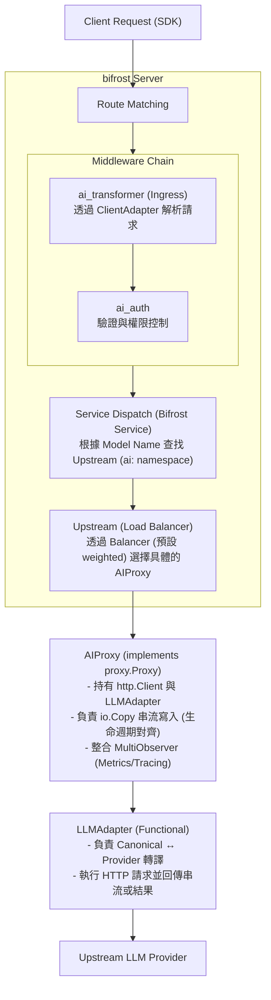

# AI Gateway on Bifrost — Design Spec

## 1. Overview

在 bifrost gateway 上建構一個 AI Gateway，讓使用者可以透過多種 SDK 協議的接口 (OpenAI Chat / Responses / Anthropic / Gemini) 呼叫多個上遊 LLM provider。

本設計的核心目標是將 **「基礎設施 (Infrastructure)」** 與 **「模型協議 (LLM Protocol)」** 徹底解耦，並對齊 Bifrost 既有的 Proxy/Upstream 設計，同時提供生產級別的監控與計費能力。

## 2. Architecture

### 2.1 核心架構圖



### 2.2 職責分工 (Separation of Concerns)

| 組件 | 職責 | 關鍵方法 |
| :--- | :--- | :--- |
| **ai_transformer** | **Ingress門戶**: 呼叫 `ClientAdapter` 進行雙像轉譯。注入 `ClientAdapter` 實例與原始模型名至 Context。管理路由變數。 | `ServeHTTP()` |
| **ClientAdapter** | **下游協議**: 負責 Canonical ↔ Client 轉譯。處理不同的入口 SDK 格式與 Egress 串流重新編碼。 | `ToChatRequest()`, `WrapEgressStream()` |
| **Bifrost Service** | **Router**: 直接重用既有邏輯。透過動態路由尋找 `ai:` 命名空間的 Upstream。**需確保併發安全，避免寫入共享的 s.upstream 欄位。** | `ServeHTTP()` |
| **Model (as Upstream)** | **Load Balancer**: 將 `models` 配置轉換為 `Upstream`，管理多個 Target 的權重。 | `Balancer().Select()` |
| **AIProxy** | **執行載體**: 實作 `proxy.Proxy`。負責連線池、**阻塞式 I/O 寫入**與**監控觸發**。實作模型名稱覆寫與錯誤攔截。 | `ServeHTTP()` |
| **LLMAdapter** | **上游協議**: 負責 Canonical ↔ Provider 轉譯與執行。參考 GoModel 設計。發生錯誤時直接返回 `*ai.AIError`。 | `Chat()`, `StreamChat()` |

## 3. Config

### 3.1 AI Config Struct

```go
type Options struct {
    AI     *AIOptions                 `json:"ai" yaml:"ai"`
    Models map[string]*AIModelOptions `json:"models" yaml:"models"`
}

type AIOptions struct {
    Providers   map[string]*AIProvider `yaml:"providers"`
    PricingFile string                 `yaml:"pricing_file"` // 新增：外部全局價格表路徑
}

type AIProvider struct {
    Handler string `json:"handler" yaml:"handler"` // "openai-chat" | "openai-responses" | "anthropic" | "gemini"
    BaseURL string `json:"base_url" yaml:"base_url"`
    APIKey  string `json:"api_key" yaml:"api_key"`
}

type AIModelOptions struct {
    Balancer *AIBalancerOptions `yaml:"balancer"`
    Targets  []AITargetOptions  `yaml:"targets"`
}

type AIBalancerOptions struct {
    Type string `yaml:"type"` // 預設為 "weighted" (加權隨機)
}

type AITargetOptions struct {
    Target  string            `json:"target"  yaml:"target"` // "provider_id/actual-model-name" 格式
    Weight  int               `json:"weight"  yaml:"weight"` // 負載平衡權重，預設 1
    Pricing *AIPricingOptions `json:"pricing" yaml:"pricing"` // 新增：Target 級別費率覆寫
}

type AIPricingOptions struct {
    InputPerMtok       float64 `json:"input_per_mtok"        yaml:"input_per_mtok"`
    OutputPerMtok      float64 `json:"output_per_mtok"       yaml:"output_per_mtok"`
    CachedInputPerMtok float64 `json:"cached_input_per_mtok" yaml:"cached_input_per_mtok"`
}
```

### 3.2 完整 Config 範例

```yaml
services:
  ai_gateway:
    type: ai # 自動啟動動態路由與模型注入

ai:
  providers:
    anthropic-us:
      handler: "anthropic"
      base_url: "https://api.anthropic.com"
      api_key: "ANTHROPIC_API_KEY"
    openai-official:
      handler: "openai-chat"
      base_url: "https://api.openai.com/v1"
      api_key: "OPENAI_API_KEY"

models:
  gpt-4o:
    balancer: { type: "weighted" }
    targets:
      - target: "openai-official/gpt-4o"
        weight: 3
      - target: "anthropic-us/claude-3-5-sonnet-20241022"
        weight: 1
```

### 3.3 Target 解析與驗證規則

1.  **解析**：`target.Target = "provider_id/actual-model-name"`。
2.  **驗證**：系統啟動時必須驗證 `provider_id` 存在於 `ai.providers` 中，且格式正確包含 `/`。

## 4. Data Structures (Canonical Types)

所有中樞結構體定義於 **`pkg/ai/types.go`**。

### 4.1 Chat & Responses 家族
*   `ChatRequest`: 對齊 OpenAI Chat Completion 格式。包含 `UnknownFields map[string]any` 支援 Passthrough。
    *   **防呆實作提示 (Passthrough)**：`ChatRequest` 必須實作自訂的 `UnmarshalJSON` (將未定義欄位掃入 map) 與 `MarshalJSON` (將 map 平坦合併回頂層結構)，否則透傳欄位會遺失或格式錯誤。
*   `ChatResponse`: 統一的對話響應。
*   `StreamChunk`: SSE 串流的中樞格式。

### 4.2 Usage & Metadata
*   `UsageMetadata`: 包含 `Model` (原始虛擬名), `UserID`, `RouteID`, `Provider` 以及時間指標 (`StartTime`, `FirstByteTime`, `EndTime`)。
*   `Usage`: 包含 `PromptTokens`, `CompletionTokens` 以及**新增的 `InputCost`, `OutputCost` (USD)**。
*   **輔助方法**：需提供 `TTFB()`, `TotalDuration()` 與 `CalculateCost()` 計算方法。

## 5. 雙適配器介面 (Adapter Symmetry)

### 5.1 LLMAdapter (對上游 Provider)
負責執行請求。發生上游錯誤時，**必須直接返回 `*ai.AIError`**。

```go
type LLMAdapter interface {
    Name() string
    Chat(ctx context.Context, req *ChatRequest) (*ChatResponse, error)
    StreamChat(ctx context.Context, req *ChatRequest) (io.ReadCloser, error)
    Responses(ctx context.Context, req *ResponsesRequest) (*ResponsesResponse, error)
    StreamResponses(ctx context.Context, req *ResponsesRequest) (io.ReadCloser, error)
}
```

### 5.2 ClientAdapter (對下游客戶端)
負責 Ingress 解析與 Egress 轉譯（含 Unary 與 Stream）。

```go
type ClientAdapter interface {
    Name() string
    ToChatRequest(body []byte) (*ChatRequest, error)
    ToClientChatResponse(resp *ChatResponse) (any, error)
    WrapEgressStream(stream io.ReadCloser) io.ReadCloser
}
```

## 6. LLM Adapters 實作細節

| Handler | 認證方式 | 轉譯重點 |
| :--- | :--- | :--- |
| `openai-chat` | `Authorization: Bearer` | Identity Transformation (透傳) |
| `anthropic` | `x-api-key` | System Message 提取, `tool_use` 轉換, SSE 事件重組 |
| `gemini` | `x-goog-api-key` | 動態 Endpoint, `contents[]` 映射 |

## 7. Middleware: ai_transformer

`ai_transformer` 負責所有與「客戶端」對接的格式轉譯與 I/O 控制。

*   **Ingress (Phase 1 - Before Next)**:
    *   建立並將 `ClientAdapter` 存入 Context。
    *   調用 `ClientAdapter.ToChatRequest()` 解析原始 Body。
    *   將解析出的 `ChatRequest` 存入 Context。
    *   將原始模型名存入 `ai_virtual_model_name`。
    *   註冊路由變數 `variable.AIModelName = "ai:" + req.Model`。
*   **Egress (Phase 2 - After Next)**:
    *   **錯誤攔截**：檢查 Hertz 錯誤鏈 (`c.Errors`)。若存在 `ai.AIError`，則調用 `ClientAdapter` 轉譯為符合客戶端 SDK 規範的錯誤 JSON 並呼叫 `c.JSON()` 寫回。
    *   **注意**：成功路徑的 Unary/Stream 寫入由 `AIProxy` 負責，以確保監控指標的完整性。

## 8. AI 監控與觀測指標 (Observability)

系統使用原生的 `github.com/prometheus/client_golang/prometheus` 來註冊與暴露指標。

### 8.1 Prometheus Metrics 與 Labels 定義

所有指標均攜帶 `model` (虛擬名) 與 `provider` Labels。

| Prometheus Metric 名稱 | 類型 | 計算方式 / 觸發時機 | 意義 |
| :--- | :--- | :--- | :--- |
| `bifrost_ai_request_ttfb_seconds` | **Histogram** | `FirstByteTime - StartTime` | 模型思考速度 (TTFB)。 |
| `bifrost_ai_request_duration_seconds`| **Histogram** | `EndTime - StartTime` | 用戶端感知的總請求延遲。 |
| `bifrost_ai_generation_tps` | **Histogram** | `CompletionTokens / (EndTime - FirstByteTime)` | 每秒生成速率。 |
| `bifrost_ai_prompt_tokens_total` | **Counter** | 請求結束時累加 | 輸入 Token 總數。 |
| `bifrost_ai_completion_tokens_total` | **Counter** | 請求結束時累加 | 輸出 Token 總數。 |

### 8.2 統計機制
*   **MultiObserver**: 透過 `ai.UsageObserver` 介面，支援同時向計費系統、Prometheus 與 OTEL 寫入。
*   **ObservedStream**: 在 `AIProxy` 的寫入迴圈中攔截 T1 (FirstByte) 與最後一個 Usage Chunk (T2)。

### 8.3 模型成本計費 (Model Cost Calculation)

系統採用多層級回退 (Fallback) 機制來解析模型費率，計算單位統一為「每百萬 Token 的美元價格 (USD per 1M Tokens)」。

#### 8.3.1 費率解析優先級 (Resolution Order)
1. **Target Override**: 優先使用 `models.targets[x].pricing` 配置。
2. **External Global**: 若未配置，則從 `ai.pricing_file` 指定的外部 JSON 中查找。
3. **Embedded Global**: 若外部文件也未定義，則使用 Bifrost 內置的 `pkg/ai/pricing/prices.json` (透過 `//go:embed` 載入)。

#### 8.3.2 成本計算指標
| Prometheus Metric 名稱 | 類型 | 意義 |
| :--- | :--- | :--- |
| `bifrost_ai_request_cost_usd_total` | **Counter** | 累計消耗的估算美元成本 (`InputCost + OutputCost`)。 |

## 9. Initialization & Routing

1.  **AI 模型加載與注入 (The `loadModels` Function)**：
    *   在 `newService` 過程中，無論 Service 類型為何，都將調用獨立的 `loadModels` 函數。
    *   該函數負責將全域 `models` 配置編譯為 `Upstream` 物件（內含 `AIProxy`），並強制加上 `ai:` Namespace。
    *   轉換後的 AI Upstreams 將被注入到目前 Service 實例的 `svc.upstreams` 映射表中。這使得所有 Service 都能夠透過變數路由到 AI 模型。
2.  **AI Service 特化處理**：
    *   若偵測到 `serviceOptions.Type == "ai"`，`newService` 會自動將其 `dynamicUpstream` 變數設定為 `variable.AIModelName`。
    *   此時，該 Service 會忽略傳統的 `upstreams` 配置區塊。
3.  **併發安全**：`Service.ServeHTTP` **嚴禁寫入共享的 `s.upstream` 欄位**，必須使用區域變數處理選定的 Proxy 實例。

## 10. AIProxy 實作細節

*   **阻塞式 I/O 與生命週期對齊**：為了確保 `Service` 層的 `UpstreamDuration` 監控指標包含完整的數據交換時間，`AIProxy` 必須阻塞直到響應完全寫回客戶端為止。
*   **Unary (非串流) 寫入責任**：`AIProxy` 負責成功路徑的最終寫入。在拿到 `LLMAdapter.Chat()` 結果後，需調用 `ClientAdapter.ToClientChatResponse()` 轉換格式，並直接呼叫 `c.JSON()` 寫回客戶端。
*   **錯誤處理責任 (Error Handling)**：
    *   **前期錯誤**：若 `AIProxy` 在開始寫入響應前執行失敗（例如調用 `LLMAdapter` 時），必須捕捉其返回的 `*ai.AIError` 並呼叫 `c.Error(aiErr)` 拋出。此時**嚴禁直接寫入**，應交由 `ai_transformer` (Phase 2) 進行格式化寫入。
    *   **串流中途錯誤 (Mid-stream)**：若 SSE 傳輸已開始（Header 已送出），此時 `ai_transformer` 無法攔截。`AIProxy` 必須在 `Write` 迴圈中捕捉 Read 錯誤，並**直接向 Socket 寫入**一個 SSE 錯誤事件（例如 `data: {"error":{...}}\n\n`）後送出 `[DONE]` 結束連線。
*   **Streaming (串流) 強制 Flush 迴圈**：
    *   **🚨 嚴禁使用標準 `io.Copy`**：由於緩衝機制，標準 `io.Copy` 會破壞 SSE 的打字機效果。
    *   **實作規範**：必須採用自定義迴圈：`for { Read chunk -> c.Write -> c.Flush() }`，確保每個生成片段即時送達。
*   **模型名稱生命週期與遮蔽**：
    *   **Context 變數**：保持為虛擬模型名（如 `ai:gpt-4o`），用於日誌與計費。
    *   **Request 結構體**：發送請求前覆寫為實體模型名（如 `claude-3-5`）。
    *   **Response 側**：所有回傳給客戶端的 JSON/SSE，其 `model` 欄位必須覆寫回 `ai_virtual_model_name`，防止內部型號洩漏。
*   **Usage 注入**：對於 Streaming 請求，**自動注入 `stream_options.include_usage: true`** 以確保計費。
*   **SSE 零緩衝**：使用 `c.Response.HijackWriter` 接管寫入流。

## 11. 測試計畫 (Test Plan)

為了驗證 AI Gateway 的功能完整性，我們將針對以下情境編寫 **單元測試 (Unit Tests)** 進行自動化驗證。此外，`server/testserver` 將提供模擬的 OpenAI Chat API (支援 Unary 與 Streaming) 供開發者進行 **手動測試 (Manual Testing)**：

| Test Case | 目的 | Ingress | Egress | 驗證指標 (Success Criteria) |
| :--- | :--- | :--- | :--- | :--- |
| **1. 單次請求透傳 (Unary)** | 驗證最基本的 OpenAI API 透傳功能。 | OpenAI Chat | OpenAI Chat | 客戶端收到完整的 200 OK 與正確的 JSON 結構。`UpstreamDuration` 紀錄正確。 |
| **2. 串流請求透傳 (Streaming)** | 驗證 SSE 長連線不被緩衝。 | OpenAI Chat | OpenAI Chat | 客戶端能即時收到 `data: {...}`，結尾包含 `[DONE]`，無 `io.Copy` 延遲。 |
| **3. 錯誤捕捉 (Error Interception)** | 驗證上游回傳 4xx/5xx 時，`AIProxy` 與 `ai_transformer` 的攔截轉譯。 | OpenAI Chat | OpenAI Chat | 模擬 401 Unauthorized。客戶端收到統一的 Error JSON，而非原始錯誤。 |
| **4. 負載均衡 (Weighted)** | 驗證多模型併發請求無 Data Race，且符合權重分配。 | OpenAI Chat | OpenAI Chat x2 | 100 次請求中，流量分配比例符合 Weight 設定，且無併發寫入錯誤。 |
| **5. 統計回報 (Usage Observer)** | 驗證 `ObservedStream` 是否能成功攔截並回報 Tokens。 | OpenAI Chat | OpenAI Chat | 發送帶有 `stream_options.include_usage: true` 的請求。驗證日誌中印出正確的 `UsageMetadata` 與 Token 數。 |
| **6. 模型名稱遮蔽 (Privacy)** | 驗證響應中不洩露內部後端實體模型名稱。 | OpenAI Chat | Anthropic | 客戶端收到的 JSON/SSE `model` 欄位始終顯示虛擬名稱 (如 `gpt-4o`)。 |

## 12. 修改清單 (Checklist)

| # | 目標 | 檔案路徑 |
|---|---|---|
| 1 | 定義 Canonical 類型 (含 UnknownFields) 與 Context Keys | `pkg/ai/types.go` |
| 2 | 定義 Adapter 介面 | `pkg/ai/adapter.go`, `pkg/ai/client_adapter.go` |
| 3 | 修復 Service 併發安全與 AI 注入 | `pkg/gateway/service.go` |
| 4 | 實作 AIProxy (SSE 錯誤處理與模型遮蔽) | `pkg/proxy/ai/proxy.go` |
| 5 | 實作 MultiObserver 與 ObservedStream (帶有緩衝安全切割) | `pkg/ai/observer.go` |
| 6 | 建立 Pricing Registry (含內置 JSON 與多級解析邏輯) | `pkg/ai/pricing/` |
| 7 | 擴展 AI 指標計費與成本上報 | `pkg/telemetry/metrics/ai.go` |
| 8 | 定義全域動態路由變數 `AIModelName` | `pkg/variable/keys.go` |
| 9 | 更新 Ingress Middleware (注入 Adapter 與保留原名) | `pkg/middleware/aitransformer/ai_transformer.go` |
| 10 | 實作具體 LLM & Client Adapters | `pkg/ai/adapter_openai.go` 等 |
| 11 | 註冊組件 | `pkg/initialize/pkg.go` |
