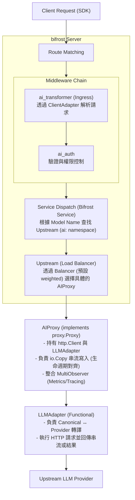

# AI Gateway on Bifrost — Design Spec

## 1. Overview

在 bifrost gateway 上建構一個 AI Gateway，讓使用者可以透過多種 SDK 協議的接口 (OpenAI Chat / Responses / Anthropic / Gemini) 呼叫多個上遊 LLM provider。

本設計的核心目標是將 **「基礎設施 (Infrastructure)」** 與 **「模型協議 (LLM Protocol)」** 徹底解耦，並對齊 Bifrost 既有的 Proxy/Upstream 設計，同時提供生產級別的監控與計費能力。

## 2. Architecture

### 2.1 核心架構圖



### 2.2 職責分工 (Separation of Concerns)

| 組件 | 職責 | 關鍵方法 |
| :--- | :--- | :--- |
| **ai_transformer** | **Ingress門戶**: 呼叫 `ClientAdapter` 進行雙向轉譯。解析模型名稱並註冊 `variable.AIModelName` (帶有 `ai:` 前綴)。 | `ServeHTTP()` |
| **ClientAdapter** | **下游協議**: 負責 Canonical ↔ Client 轉譯。處理不同的入口 SDK 格式。 | `ToChatRequest()`, `WrapEgressStream()` |
| **Bifrost Service** | **Router**: 直接重用既有邏輯。透過動態路由尋找 `ai:` 命名空間的 Upstream。 | `ServeHTTP()` |
| **Model (as Upstream)** | **Load Balancer**: 將 `models` 配置轉換為 `Upstream`，管理多個 Target 的權重。 | `Balancer().Select()` |
| **AIProxy** | **執行載體**: 實作 `proxy.Proxy`。負責連線池、**阻塞式 I/O 寫入**與**監控觸發**。 | `ServeHTTP()` |
| **LLMAdapter** | **上游協議**: 負責 Canonical ↔ Provider 轉譯與執行。參考 GoModel 設計。 | `Chat()`, `StreamChat()` |

## 3. Config

### 3.1 AI Config Struct

```go
type Options struct {
    AI     *AIOptions                 `json:"ai" yaml:"ai"`
    Models map[string]*AIModelOptions `json:"models" yaml:"models"`
}

type AIOptions struct {
    Providers map[string]*AIProvider `yaml:"providers"`
}

type AIProvider struct {
    Handler string `json:"handler" yaml:"handler"` // "openai-chat" | "openai-responses" | "anthropic" | "gemini"
    BaseURL string `json:"base_url" yaml:"base_url"`
    APIKey  string `json:"api_key" yaml:"api_key"`
}

type AIModelOptions struct {
    Balancer *AIBalancerOptions `yaml:"balancer"`
    Targets  []AITargetOptions  `yaml:"targets"`
}

type AIBalancerOptions struct {
    Type string `yaml:"type"` // 預設為 "weighted" (加權隨機)
}

type AITargetOptions struct {
    Target string `json:"target" yaml:"target"` // "provider_id/actual-model-name" 格式
    Weight int    `json:"weight" yaml:"weight"` // 負載平衡權重，預設 1
}
```

### 3.2 完整 Config 範例

```yaml
services:
  ai_gateway:
    type: ai

ai:
  providers:
    anthropic-us:
      handler: "anthropic"
      base_url: "https://api.anthropic.com"
      api_key: "ANTHROPIC_API_KEY"
    openai-official:
      handler: "openai-chat"
      base_url: "https://api.openai.com/v1"
      api_key: "OPENAI_API_KEY"

models:
  gpt-4o:
    balancer: { type: "weighted" }
    targets:
      - target: "openai-official/gpt-4o"
        weight: 3
      - target: "anthropic-us/claude-3-5-sonnet-20241022"
        weight: 1
```

### 3.3 Target 解析規則

當選定某個 `AITargetOptions` 後，會對其 `Target` 欄位進行拆分：
`target.Target = "provider_id/actual-model-name"`
例如 `"anthropic-us/claude-3-5-sonnet"` ➜ Provider: `anthropic-us`, 實體模型: `claude-3-5-sonnet`。

## 4. Data Structures (Canonical Types)

所有中樞結構體定義於 **`pkg/ai/types.go`**。

### 4.1 Chat & Responses 家族
*   `ChatRequest`: 對齊 OpenAI Chat Completion 格式。包含 `UnknownFields map[string]any` 支援 Passthrough。
*   `ChatResponse`: 統一的對話響應。
*   `StreamChunk`: SSE 串流的中樞格式。

### 4.2 Usage & Metadata
*   `UsageMetadata`: 包含 `Model`, `UserID`, `RouteID`, `Provider` 以及時間指標 (`StartTime`, `FirstByteTime`, `EndTime`)。
*   `Usage`: 包含 Token 計數（含 `cached_tokens`, `reasoning_tokens`）。

## 5. 雙適配器介面 (Adapter Symmetry)

### 5.1 LLMAdapter (對上游 Provider)
負責執行請求並返回 Canonical 結果或 `io.ReadCloser`。

```go
type LLMAdapter interface {
    Name() string
    Chat(ctx context.Context, req *ChatRequest) (*ChatResponse, error)
    StreamChat(ctx context.Context, req *ChatRequest) (io.ReadCloser, error)
    Responses(ctx context.Context, req *ResponsesRequest) (*ResponsesResponse, error)
    StreamResponses(ctx context.Context, req *ResponsesRequest) (io.ReadCloser, error)
}
```

### 5.2 ClientAdapter (對下游客戶端)
負責 Ingress 解析與 Egress 串流重新編碼。

```go
type ClientAdapter interface {
    Name() string
    ToChatRequest(body []byte) (*ChatRequest, error)
    WrapEgressStream(stream io.ReadCloser) io.ReadCloser
}
```

## 6. LLM Adapters 實作細節

| Handler | 認證方式 | 轉譯重點 |
| :--- | :--- | :--- |
| `openai-chat` | `Authorization: Bearer` | Identity Transformation (透傳) |
| `anthropic` | `x-api-key` | System Message 提取, `tool_use` 轉換 |
| `gemini` | `x-goog-api-key` | 動態 Endpoint, `contents[]` 映射 |

## 7. AI 監控與觀測指標 (Observability)

| 指標名稱 | 定義 | 計算方式 | 意義 |
| :--- | :--- | :--- | :--- |
| **TTFB** | 首字節延遲 | `FirstByteTime - StartTime` | 模型思考速度 |
| **TPS** | 每秒生成速度 | `CompletionTokens / (EndTime - FirstByteTime)` | 模型生成速率 |
| **Total Duration** | 總請求耗時 | `EndTime - StartTime` | 用戶端感知的總延遲 |

### 7.1 統計機制
*   **MultiObserver**: 透過 `ai.UsageObserver` 介面，支援同時分發數據。
*   **ObservedStream**: 在 `AIProxy` 執行 `io.Copy` 時，攔截 T1 (FirstByte) 與最後一個 Usage Chunk (T2)。

## 8. Initialization & Routing

1.  **隱式轉換**：啟動時將 `models` 編譯為 `Upstream` 物件。
2.  **Namespace**：名稱強制加上 `ai:` 前綴（如 `ai:gpt-4o`）。
3.  **動態路由**：`ai_transformer` 設定 `variable.AIModelName` 為 `ai:xxx`。

## 9. AIProxy 實作細節

*   **阻塞式 I/O**：`AIProxy` 必須阻塞直到 `io.Copy` 結束。
*   **模型名稱生命週期**：
    *   **Context 變數**：保持為虛擬模型名（如 `ai:gpt-4o`），用於日誌。
    *   **Request 結構體**：覆寫為實體模型名（如 `claude-3-5`），用於上游請求。
*   **SSE 零緩衝**：使用 `c.Response.HijackWriter` 接管寫入流。

## 10. 修改清單 (Checklist)

| # | 目標 | 檔案路徑 |
|---|---|---|
| 1 | 定義 Canonical 類型 (含 UnknownFields) | `pkg/ai/types.go` |
| 2 | 定義 LLMAdapter 與 ClientAdapter 介面 | `pkg/ai/adapter.go`, `pkg/ai/client_adapter.go` |
| 3 | 實作 MultiObserver 與 ObservedStream | `pkg/ai/observer.go` |
| 4 | 實作 AIProxy (Proxy 介面) 並處理阻塞式 I/O | `pkg/proxy/ai/proxy.go` |
| 5 | 修改 Service 初始化邏輯 (Models to Upstreams) | `pkg/gateway/service.go` |
| 6 | 定義全域動態路由變數 `AIModelName` | `pkg/variable/keys.go` |
| 7 | 更新 Ingress Middleware (調用 ClientAdapter) | `pkg/middleware/aitransformer/ai_transformer.go` |
| 8 | 實作具體 LLM & Client Adapters | `pkg/ai/adapter_openai.go` 等 |
